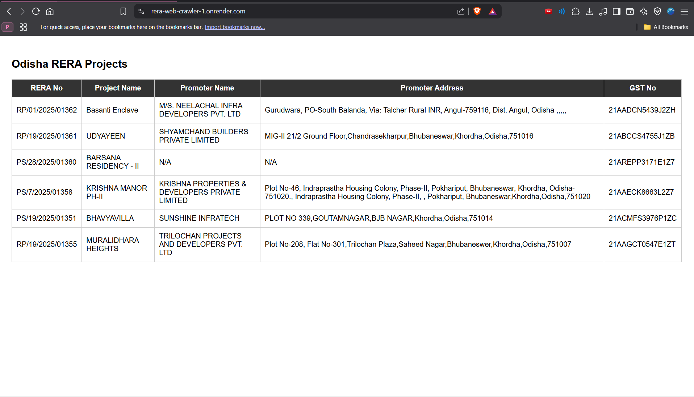

# 🏗️ Odisha RERA Project Scraper & Web Viewer

This project includes:

- 🕷️ A Python **web scraper** that extracts project data from the [Odisha RERA website](https://rera.odisha.gov.in/projects/project-list)
- ☁️ A connection to **MongoDB Atlas** to store the data
- 🌐 A **Flask web app** to display the data
- 🚀 A full deployment guide using **Render**

---

## 📌 Features

### ✅ Scraper
- Extracts:
  - **RERA Regd. No**
  - **Project Name**
  - **Promoter Name**
  - **Promoter Address**
  - **GST No**
- Collects data from modals & nested tabs
- Stores output in:
  - `odisha_rera_projects.csv`
  - MongoDB collection

### ✅ Web App
- Built with **Flask**
- Reads data from MongoDB Atlas
- Displays in a responsive HTML table
- Simple and clean UI using Jinja2 templating

---

## 💻 Requirements

Create a `requirements.txt` with:

```
selenium
webdriver-manager
flask
pymongo
python-dotenv
```

---

## ⚙️ Setup Instructions

### 1️⃣ Clone the Repo

```bash
git clone https://github.com/yourusername/rera-web-crawler.git
cd rera-web-crawler
```

---

### 2️⃣ Create a Virtual Environment

```bash
python -m venv venv
source venv/bin/activate  # On Windows: venv\Scripts\activate
```

Then install dependencies:

```bash
pip install -r requirements.txt
```

---

### 3️⃣ Configure Environment Variables

Create a `.env` file in the root directory:

```ini
DB_URI=mongodb+srv://<username>:<password>@<cluster>.mongodb.net/portfolio_db?retryWrites=true&w=majority
DB_NAME=portfolio_db
COLLECTION_NAME=projects
```

🔐 Don’t forget to add `.env` to your `.gitignore`.

---

### 4️⃣ Run the Scraper

```bash
python odisha_rera_scraper.py
```

✅ This will save data to:
- `odisha_rera_projects.csv`
- MongoDB

> 💡 To run in headless mode, uncomment the `--headless` line in the script.

---

### 5️⃣ Run the Flask Web App Locally

```bash
python app.py
```

Then go to [http://localhost:5000](http://localhost:5000) to view the project data.

---

## 🌐 Deploy to Render (Free Hosting)

### Steps:

1. Push your code to GitHub
2. Go to [Render](https://render.com)
3. Create a **new Web Service**
4. Connect to your GitHub repo

#### Render Settings:

- **Build Command**:  
  ```bash
  pip install -r requirements.txt
  ```

- **Start Command**:  
  ```bash
  python app.py
  ```

- **Environment Variables**:
  - `DB_URI` = your MongoDB URI
  - `DB_NAME` = portfolio_db
  - `COLLECTION_NAME` = projects

#### Done!

Render will deploy your web viewer at:

```
https://rera-web-crawler-1.onrender.com/
```

---

## 📂 Output Example (CSV)

| RERA No     | Project Name   | Promoter Name    | Promoter Address         | GST No           |
|-------------|----------------|------------------|---------------------------|------------------|
| ORERA/PRJ/1 | Sunrise Valley | ABC Developers   | Bhubaneswar, Odisha       | 29ABCDE1234F1Z5  |

---

## 📷 Screenshot

```

```

## 👨‍💻 Author

**Yugendran Kumar**  
